# دليل تَوْبَةٌ نَصُوحٌ 🌿
### *Tawbah Guide — Your Digital Companion on the Path Back to Allah*

> تطبيق إسلامي شامل يرافقك في رحلة التوبة الصادقة — من اللحظة الأولى حتى الثبات والاستقامة.

---

## 📖 نبذة عن التطبيق

**دليل التوبة النصوح** ليس مجرد تطبيق — هو رفيق روحي يفهمك ويذكّرك ويدعمك في أصعب لحظات الضعف وأجمل لحظات العودة إلى الله. يجمع بين الفقه الإسلامي الأصيل والذكاء الاصطناعي والمجتمعية ليصنع تجربة توبة حقيقية وعميقة.

---

## ✨ الأقسام والميزات

### 🏠 الصفحة الرئيسية
لوحة تحكم ذكية تعرض:
- **الهيرو الديناميكي** — خلفية إسلامية هندسية متحركة تتغير مع الوقت (فجر، إشراق، ضحى، ظهر، عصر، مغرب، عشاء، تهجد) مع قوس شمس حي يعكس وضع النهار
- **بانر إسلامي ذكي** — يعرض آية أو حديثاً أو دعاءً أو نصيحة تتناسب مع الوقت والموسم، مع إمكانية الاستماع للآية وعرض التفسير الميسر
- **بطاقة العيد الموسمية** — تظهر تلقائياً في المواسم المباركة (عيد الفطر، عيد الأضحى، العشر من ذي الحجة، يوم عرفة...) مع خيار الإغلاق
- **إحصاءات مباشرة** — أعداد التوبات والأدعية والذكر في الوقت الفعلي من جميع المستخدمين

---

### 📜 ميثاق التوبة `/covenant`
- توقيع عهد رسمي مع الله بالورقة والقلم الرقمي
- اختيار فئة الذنب وتحديد نوع المعصية
- تأكيد النية والعزم على الترك

---

### 🌅 مهام اللحظة الأولى `/day-one`
أول خطوات التوبة الفعلية فور توقيع الميثاق:
- قائمة مهام إلزامية للبداية الصحيحة
- تذكيرات بالطهارة والصلاة وقراءة القرآن
- تهيئة البيئة الروحية والمادية

---

### 🌟 رحلة النور 30 يوماً  `/journey`
- برنامج روحي هيكلي لـ 30 يوماً
- جدول يومي مفصّل لكل مرحلة من مراحل التوبة
- مهام يومية مصممة بعناية
- مهام صباحية ومسائية ومتابعة يومية
- عداد الأيام والسلسلة (Streak) والتقدم
- مراحل مفصّلة من التطهير إلى الثبات

---

### 📿 الذِّكر `/dhikr`
عداد ذكر رقمي شخصي:
- تسبيح، تحميد، تكبير، استغفار، صلاة على النبي ﷺ
- إحصائيات يومية وأسبوعية
- تذكير بالأذكار الواجبة صباحاً ومساءً

---

### 🚨 وضع الطوارئ — SOS `/sos`
للحظات الضعف القصوى عند اقتراب الوقوع في المعصية:
- استجابة فورية بآيات وأحاديث تقوية الإرادة
- خطة هروب سريعة: تذكير، دعاء، استدعاء المساعدة
- العودة للتطبيق بعد النجاة مع رسالة تشجيعية

---

### 🤖 زكيّ — الذكاء الاصطناعي الروحي `/zakiy`
مرشدك الأخ الأكبر الحكيم:
- محادثة تفاعلية تفهم سياقك الروحي والتاريخ الهجري
- يحفظ وعودك ويذكّرك بها
- يتتبع جلساتك ويقدم إرشاداً مخصصاً
- يدعم الرسائل الصوتية والنصية

---

### 📓 المذكرة الروحية `/journal`
يوميات خاصة آمنة:
- تسجيل التقدم اليومي والأفكار والمشاعر
- قراءة الإدخالات السابقة ومراجعة الرحلة
- بيئة خاصة لا يطّلع عليها أحد

---

### 📊 رسم التقدم `/progress`
- رسوم بيانية تفاعلية لأيام الاستقامة
- إحصاءات السلسلة (Streak) والتراجع والعودة
- تصوّر مرئي لرحلة الـ 30 يوماً

---

### ⚠️ أوقات الخطر `/danger-times`
تحليل ذكي لأوقات الضعف الشخصية:
- تحديد الأوقات والمواقف الأكثر خطورة على الإرادة
- خطة وقائية مخصصة لكل وقت خطر
- تنبيهات استباقية قبل أوقات الضعف المعتادة

---

### 📝 مهام هادي `/hadi-tasks`
الذكاء الاصطناعي يستخرج مهام قابلة للتنفيذ:
- التقاط أي نصيحة أو موعظة وتحويلها لخطوات عملية
- تتبع تنفيذ المهام المستخرجة
- مرتبة بالأولوية والأهمية

---

### 🃏 بطاقة التوبة `/card`
- إنشاء بطاقة توبة بصرية جميلة قابلة للمشاركة
- تخصيص النص والتصميم
- مشاركة على السوشيال ميديا أو إرسالها لأحبائك

---

### 🏆 التحدي الفيروسي `/challenge/create`
- إنشاء تحدي شخصي (7/21/40/90 يوماً)
- رابط قابل للمشاركة مع الأصدقاء لإرسال دعواتهم
- متابعة أعداد المشاركين والمشجعين المجهولين

---

### 🗺️ خريطة التوبة `/map`
- خريطة تفاعلية عالمية لنشاط التوبة
- معرفة أين يتوب الناس حول العالم
- إضافة دبوس موقعك كمشاركة جماعية

---

### 🏠 غرف الذكر الجماعي `/dhikr-rooms`
- غرف مجهولة للذكر الجماعي المشترك
- عداد تراكمي يجمع تسبيح كل المستخدمين
- أنواع متعددة (استغفار، تسبيح، صلاة على النبي...)

---

### 🤫 الدعاء السري `/secret-dua`
- إرسال دعاء مجهول لمستخدم عشوائي في التطبيق
- استقبال دعاء مجهول من أحدهم دون معرفة هويته
- تجربة أخوة إيمانية خالصة

---

### 🕌 مواقيت الصلاة `/prayer-times`
- مواعيد الصلاة دقيقة حسب موقعك الجغرافي
- تنبيهات قبل الصلاة
- معلومات عن أوقات الذكر المميزة (ثلث الليل، الإشراق...)

---

### 🤲 جدار آمين `/ameen`
- نشر دعاء للمجتمع للتأمين عليه
- قراءة أدعية الآخرين والتأمين عليها
- مجتمع دعاء مجهول ومتراحم

---

### 🎉 صفحة العيد `/eid`
صفحة موسمية احتفالية مخصصة لكل عيد:
- **هيرو احتفالي** بأنماط هندسية إسلامية متحركة وألوان تعكس نوع العيد
- **عداد تنازلي** يعدّ للعيد بالثانية
- **موعد صلاة العيد** من API مخصص حسب موقعك
- **أقرب مساجد ومصليات** في نطاق 3 كم عبر خريطة OpenStreetMap
- **سنن وإرشادات العيد** (زكاة الفطر، الغسل، التكبير، الأضحية...)
- **إرشادات 12 دولة** تُكتشف تلقائياً حسب موقعك
- **عداد التكبير الجماعي** — كل ضغطة تكبيرة مباركة
- **جدار التهاني** — اكتب تهنئتك وشاركها مع المجتمع

---

### 🕐 لحظة الإجابة `/dua-timing`
نظام ذكي لحساب قوة الدعاء لحظةً بلحظة:
- **مؤشر قوة الدعاء** — نسبة مئوية حية تجمع كل نوافذ الإجابة المفتوحة الآن (الاثنين والخميس، السجود، ثلث الليل، يوم عرفة، ساعة الجمعة...)
- **تنبيه قمة الإجابة** — عند بلوغ قوة الدعاء العتبة المحددة تظهر نافذة منبثقة في وسط الشاشة مع صوت التكبير تذكّرك بأفضل دعاء للوقت وأدلة الحديث وآداب الدعاء
- **عداد الآمين** — يحفظ كم مرة ضغطت "آمين" عند نوافذ الإجابة
- **إشعارات مجدولة** — تنبيهات تصلك تلقائياً حتى لو التطبيق مغلق في آخر ثلث الليل (٢:٣٠ صباحاً) وساعة إجابة الجمعة (٣:٣٠ عصراً)

---

### 🔔 الإشعارات الذكية
نظام إشعارات متكامل قابل للتخصيص من صفحة الحساب:
- **صوت التكبير عند الصلاة** — يُشغَّل ملف تكبير حقيقي (MP3) عند كل وقت صلاة، مع بديلين تلقائيين (نطق عربي ثم نغمات) إذا تعذّر تشغيل الملف
- **تنبيه قمة الإجابة** — تحكّم كامل في تفعيل النافذة المنبثقة والتكبير عند ذروة قوة الدعاء
- **عتبة التنبيه المخصصة** — اختر متى تُنبَّه: عند **80%** (تنبيه مبكر) أو **90%** أو **100%** (اكتمال كامل) براحتك
- **نوافذ ثابتة** — تنبيهات مجدولة لأوقات الأذكار الصباحية والمسائية والجمعة ومراجعة المساء

---

### ⚖️ الكفارة `/kaffarah`
- قائمة بكفارات الذنوب وشروطها الشرعية
- تتبع تنفيذ كفارة كل ذنب
- مرتبة حسب نوع المعصية

---

### 🌈 الرجاء `/rajaa`
- محطة روحية لاستعادة الأمل في رحمة الله
- آيات وأحاديث الرحمة والمغفرة
- قصص توبة مُلهِمة

---

### 🔍 قائمة الذنوب `/sins`
- قائمة شاملة ومصنّفة للذنوب والمعاصي
- شرح أسباب وأضرار كل ذنب
- طريق التوبة من كل نوع

---

### 📌 علامات قبول التوبة `/signs`
- قائمة بعلامات قبول التوبة الصادقة
- تشخيص ذاتي لمستوى التوبة
- تشجيع مستمر ومرحلي

---

### 🔄 التعثّر والعودة `/relapse`
- خطة إسعافية فورية بعد الوقوع في المعصية
- رسائل تدعو للنهوض دون يأس
- تصحيح مفهوم "الانتكاسة" وأنها ليست النهاية

---

## 📱 لقطات الشاشة | Screenshots

<table>
  <tr>
    <td align="center">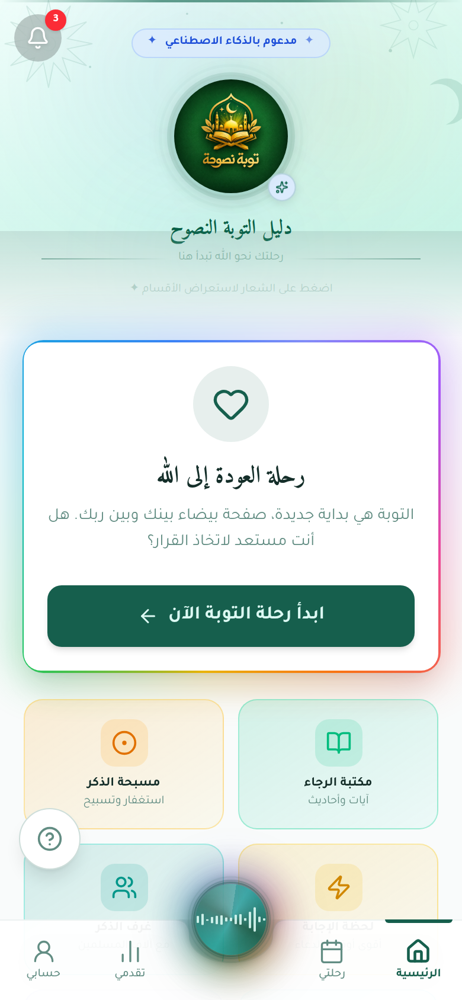<br/><sub><b>الرئيسية</b></sub></td>
    <td align="center">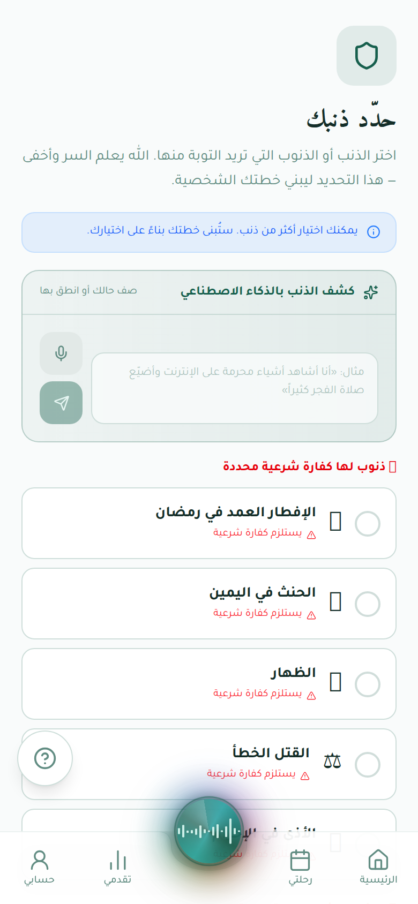<br/><sub><b>العهد</b></sub></td>
    <td align="center">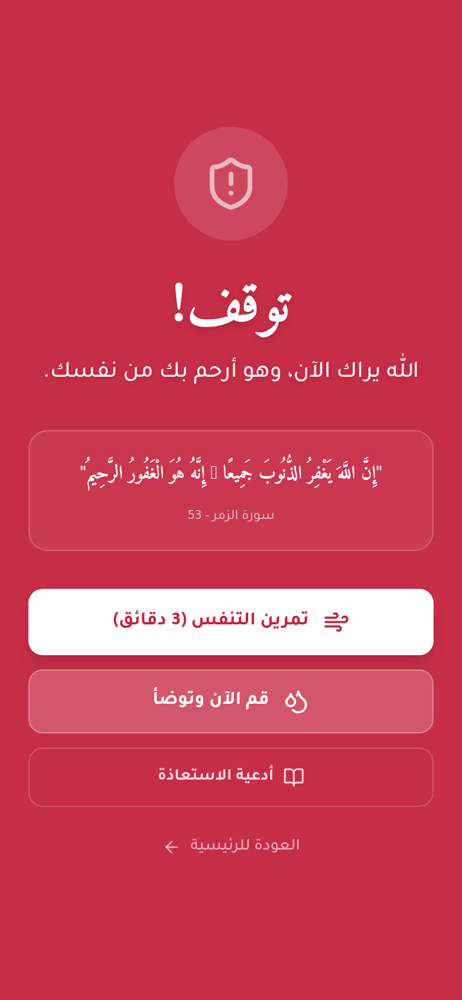<br/><sub><b>🚨 طوارئ SOS</b></sub></td>
    <td align="center">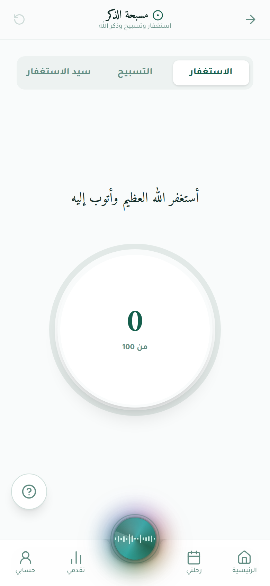<br/><sub><b>الذكر</b></sub></td>
  </tr>
  <tr>
    <td align="center">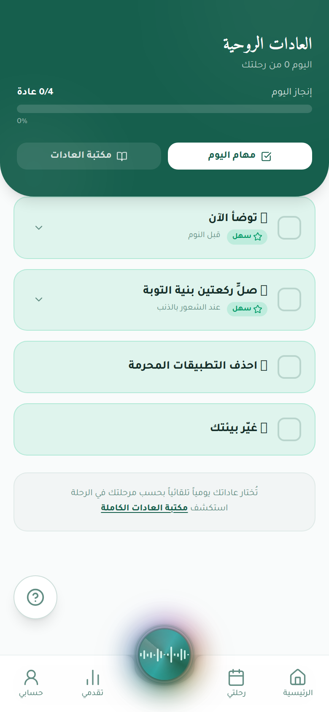<br/><sub><b>العادات</b></sub></td>
    <td align="center">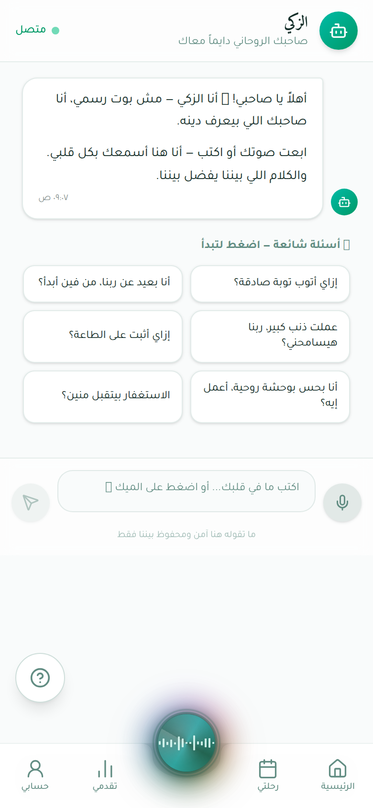<br/><sub><b>🤖 زكي AI</b></sub></td>
    <td align="center">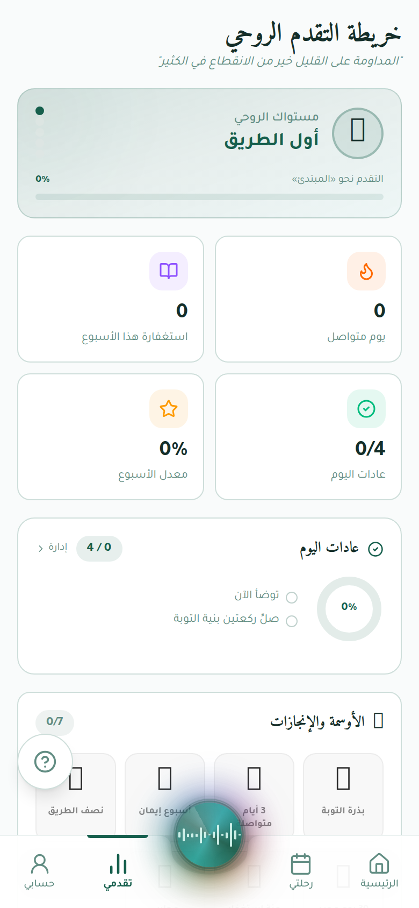<br/><sub><b>التقدم</b></sub></td>
    <td align="center">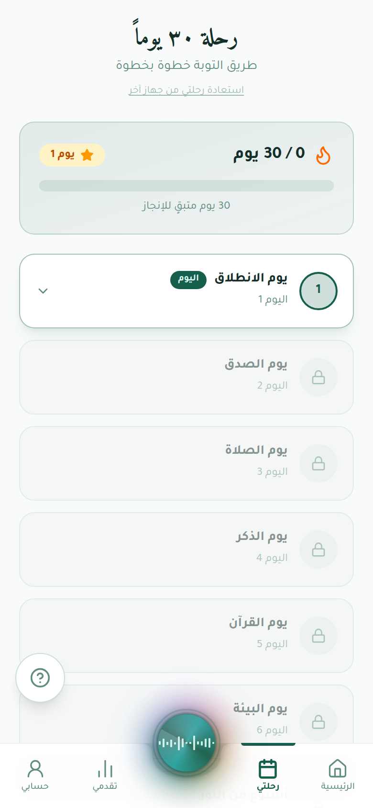<br/><sub><b>رحلة 30 يوم</b></sub></td>
  </tr>
  <tr>
    <td align="center">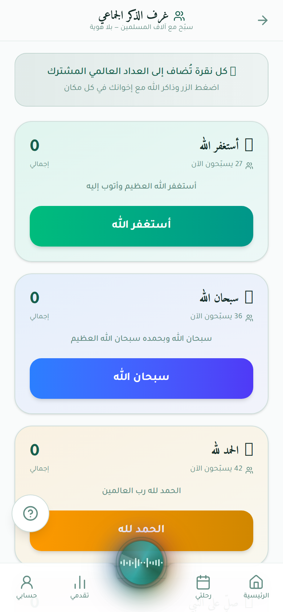<br/><sub><b>غرف الذكر</b></sub></td>
    <td align="center">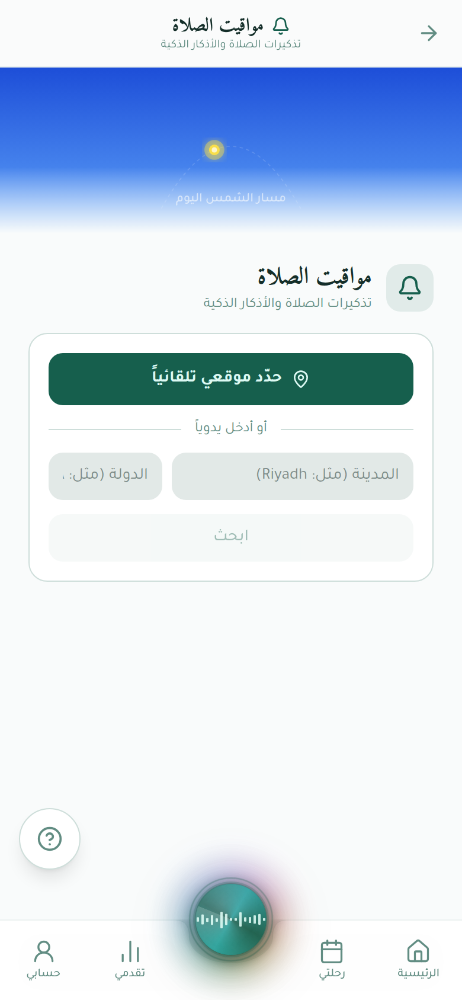<br/><sub><b>أوقات الصلاة</b></sub></td>
    <td align="center">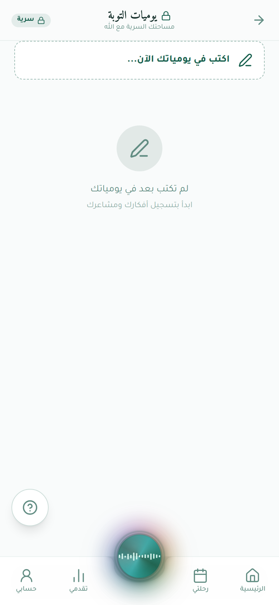<br/><sub><b>المذكرة</b></sub></td>
    <td align="center">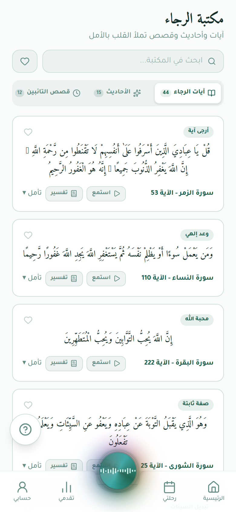<br/><sub><b>الرجاء</b></sub></td>
  </tr>
</table>

### 🖥️ سطح المكتب

<table>
  <tr>
    <td>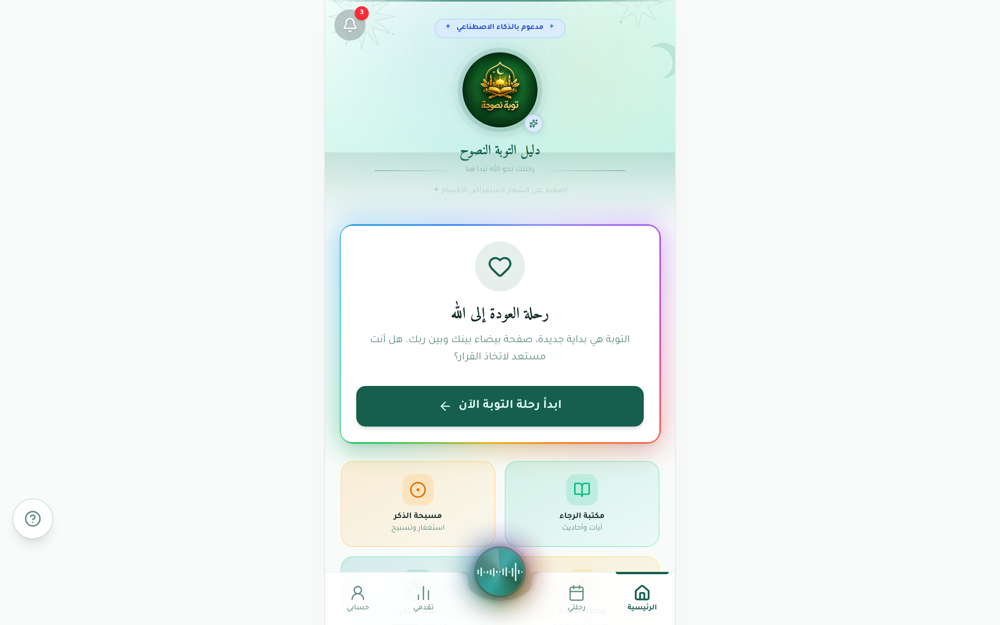<br/><sub><b>الرئيسية</b></sub></td>
    <td>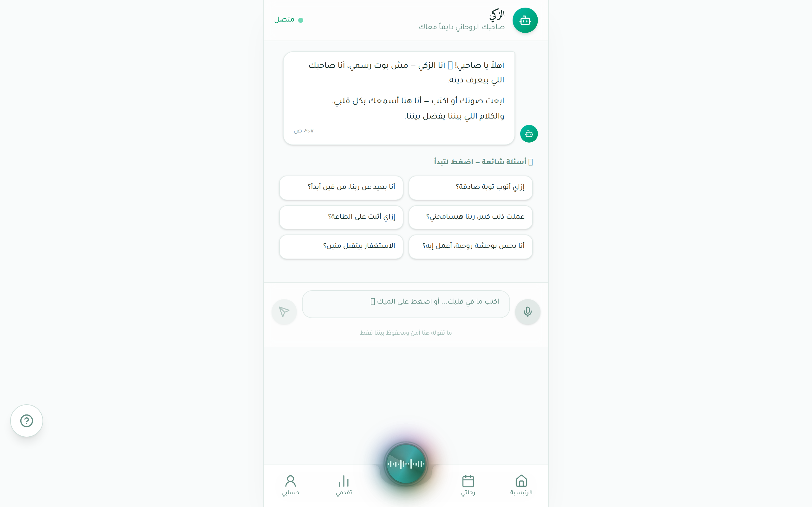<br/><sub><b>زكي AI</b></sub></td>
  </tr>
  <tr>
    <td>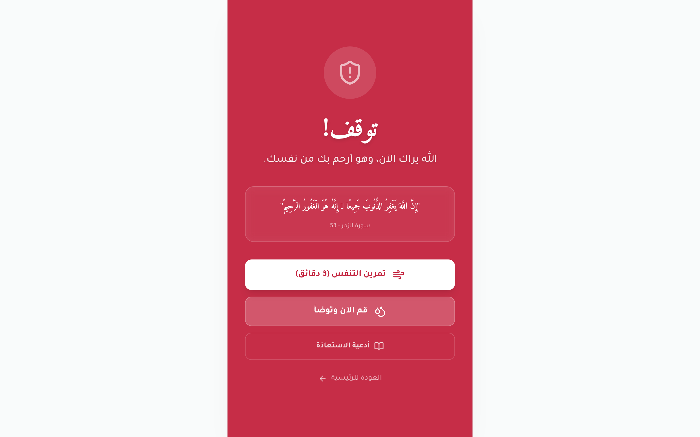<br/><sub><b>وضع الطوارئ</b></sub></td>
    <td>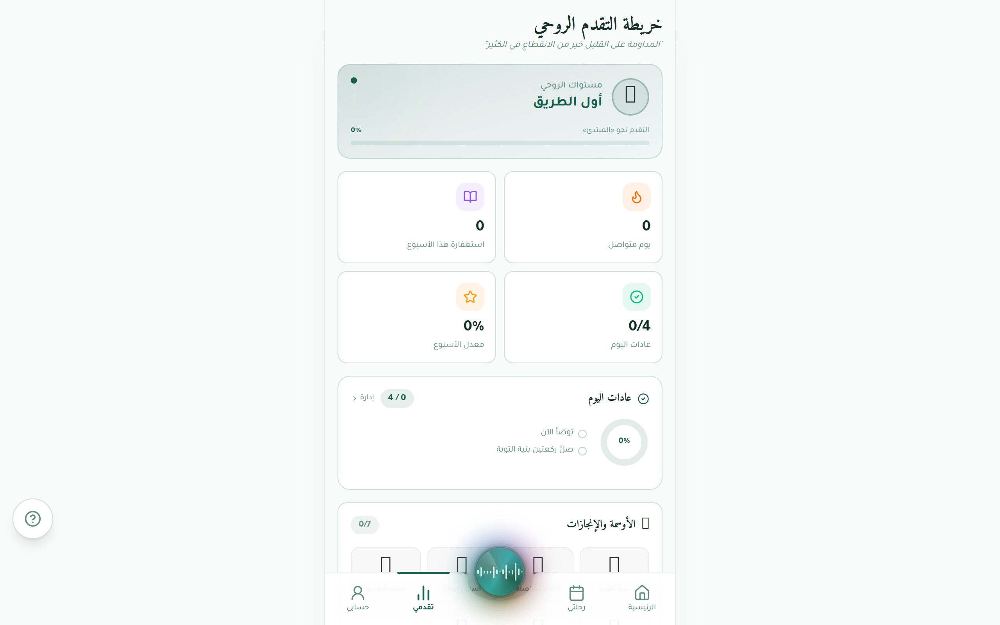<br/><sub><b>متابعة التقدم</b></sub></td>
  </tr>
  <tr>
    <td>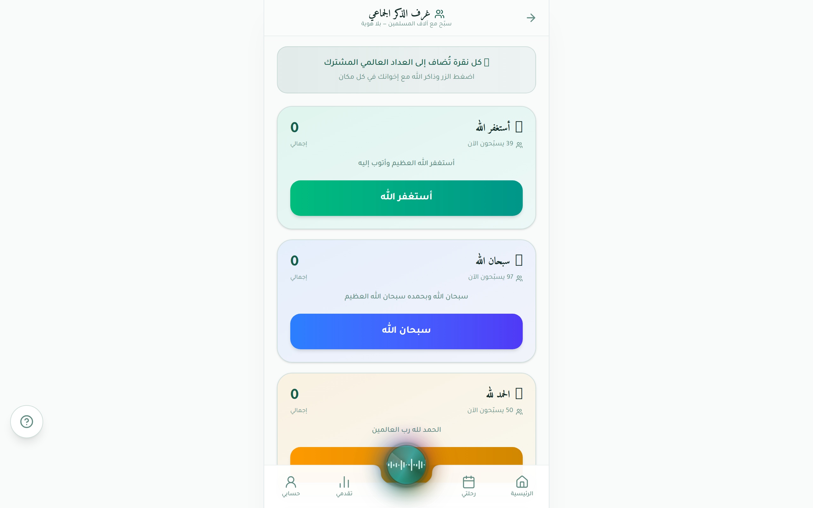<br/><sub><b>غرف الذكر الجماعي</b></sub></td>
    <td>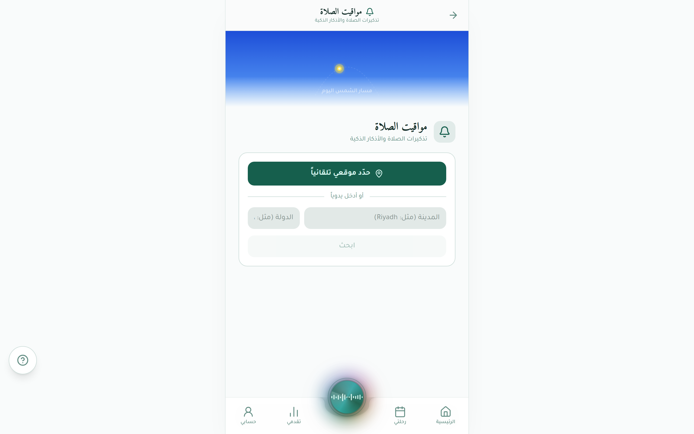<br/><sub><b>أوقات الصلاة</b></sub></td>
  </tr>
</table>

---

## 🏗️ البنية التقنية

```
tawbah-guide/
├── artifacts/
│   ├── api-server/          # Express.js + TypeScript backend
│   ├── tawbah-web/          # React 19 + Vite + Tailwind CSS v4
│   └── tawbah-mobile/       # Expo (React Native) Mobile App
├── lib/
│   ├── db/                  # Drizzle ORM + PostgreSQL schema
│   ├── api-spec/            # OpenAPI specification (YAML)
│   ├── api-zod/             # Generated Zod validation schemas
│   └── api-client-react/    # Generated React Query hooks
```

### المكدس التقني

| الطبقة | التقنية |
|--------|---------|
| **Frontend** | React 19, Vite 7, Tailwind CSS v4, Framer Motion |
| **UI Components** | Radix UI, Shadcn/UI, Lucide Icons |
| **State/Data** | TanStack React Query v5 |
| **Backend** | Node.js, Express v5, TypeScript |
| **Database** | PostgreSQL, Drizzle ORM |
| **AI** | OpenAI GPT (via Replit AI Integrations) |
| **Mobile** | Expo SDK 54, React Native, Expo Router |
| **Validation** | Zod, OpenAPI Codegen (Orval) |
| **Monorepo** | pnpm workspaces |

---

## 🌐 APIs الخارجية المستخدمة

| API | الغرض |
|-----|-------|
| `aladhan.com` | مواقيت الصلاة حسب الموقع الجغرافي |
| `alquran.cloud` | تلاوة الآيات الكريمة صوتياً |
| `overpass-api.de` | خرائط المساجد القريبة (OpenStreetMap) |
| `nominatim.openstreetmap.org` | الترميز الجغرافي العكسي (تحديد البلد) |
| OpenAI API | زكيّ AI، استخراج المهام، تحويل النص لصوت |

---

## 🚀 تشغيل المشروع

```bash
# تثبيت الحزم
pnpm install

# إعداد قاعدة البيانات
cd lib/db && pnpm drizzle-kit push

# تشغيل التطبيق (الخادم + الواجهة معاً)
PORT=8080 BASE_PATH=/api pnpm --filter @workspace/api-server run dev &
PORT=20251 BASE_PATH=/ pnpm --filter @workspace/tawbah-web run dev
```

### متغيرات البيئة المطلوبة

```env
DATABASE_URL=postgresql://...
OPENAI_API_KEY=sk-...        # لميزات الذكاء الاصطناعي
```

---

## 📱 التطبيق المحمول

```bash
# تشغيل تطبيق Expo
pnpm --filter @workspace/tawbah-mobile run start
```

---

## 🗄️ جداول قاعدة البيانات

| الجدول | الوصف |
|--------|-------|
| `user_progress` | تقدم كل مستخدم، الفترة، عدد الأيام |
| `habits` | المهام اليومية والمشروطة |
| `dhikr_count` | إحصاءات الذكر اليومية |
| `journal_entries` | إدخالات المذكرة الخاصة |
| `zakiy_memory` | ذاكرة الذكاء الاصطناعي لكل مستخدم |
| `challenges` | التحديات المشتركة والمشاركون |
| `secret_duas` | الأدعية السرية المجهولة |
| `community_duas` | جدار آمين الجماعي |
| `global_stats` | إحصاءات النشاط العالمي |

---

## 🌍 اللغات والتوطين

التطبيق مصمم بالكامل للغة العربية (RTL) مع دعم للإنجليزية في بعض المكونات.

---

## 🤝 المساهمة

هذا المشروع خيري روحي — كل مساهمة هي صدقة جارية. إن رأيت خطأً أو لديك اقتراح يُثري التجربة الروحية للمستخدمين، فالباب مفتوح.

---

<div align="center">

**﴿وَتُوبُوا إِلَى اللَّهِ جَمِيعًا أَيُّهَ الْمُؤْمِنُونَ لَعَلَّكُمْ تُفْلِحُونَ﴾**

*النور: 31*

</div>
